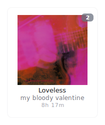
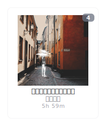
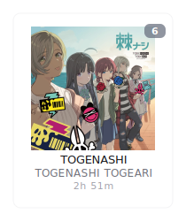
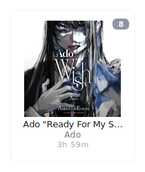
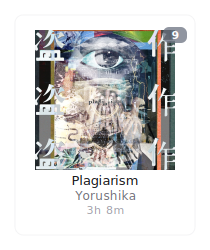
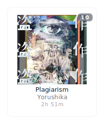

# statsfm-to-markdown 🎵

[](https://github.com/marketplace/actions/statsfm-to-markdown)
[](https://github.com/teraha-dev/statsfm-to-markdown/blob/main/LICENSE)
[](https://github.com/teraha-dev/statsfm-to-markdown/actions/workflows/statsfm.yml)
[](https://github.com/sponsors/teraha-dev)

A GitHub Action that fetches your top albums from [stats.fm](https://stats.fm/) (formerly Spotistats) for a specified time range and displays them as beautiful individual SVG cards on your GitHub profile README. Features minimal modern design with clean typography and clickable album cards. Inspired by the [lastfm-to-markdown](https://github.com/lastfm-to-markdown/lastfm-to-markdown) project.

---

## ✨ Example Output Section

This action will find the following markers in your README file and automatically insert beautiful individual SVG cards for your top albums between them:

<!-- STATSFM START -->

<p align="center"><a href="#" target="_blank" rel="noopener noreferrer"></a><a href="https://open.spotify.com/album/5K4YFkTizFoMOyN5Khfp7G" target="_blank" rel="noopener noreferrer"></a><a href="https://open.spotify.com/album/4b9nOSXSf1LROzgfYFxdxI" target="_blank" rel="noopener noreferrer"></a><a href="https://open.spotify.com/album/3o5yzVy1ZXMfyATfj9OjbV" target="_blank" rel="noopener noreferrer"></a><a href="https://open.spotify.com/album/7Ixqxq13tWhrbnIabk3172" target="_blank" rel="noopener noreferrer"></a></p>
<p align="center"><a href="https://open.spotify.com/album/5WStsinR0ZOQRoCI6rQPZA" target="_blank" rel="noopener noreferrer"></a><a href="https://open.spotify.com/album/3crSdepGPHDSUXAU9y98lG" target="_blank" rel="noopener noreferrer"></a><a href="https://open.spotify.com/album/3GH4IiI6jQAIvnHVdb5FB6" target="_blank" rel="noopener noreferrer"></a><a href="https://open.spotify.com/album/0kmPn6M3cue7rec6Unw6BD" target="_blank" rel="noopener noreferrer"></a><a href="https://open.spotify.com/album/2jgZDVp8aoPDTAqxswhz9g" target="_blank" rel="noopener noreferrer"></a></p>
<!-- STATSFM END -->

**Features:**
- Each album is a separate SVG file (1.svg, 2.svg, etc.) that links directly to Spotify
- Responsive layout with configurable items per row
- Automatically truncates long text with ellipsis
- Clean minimal design with embedded images
- Light and dark theme support for better visibility

## 🚀 Usage

Follow these steps to set up the action:

1.  **Add Markers to your README:**
    Add the following comment markers to your `README.md` file where you want the stats.fm top albums section to appear. The content between these markers will be automatically generated and updated by the action.

    ```markdown
    <!-- STATSFM START -->
    <!-- STATSFM END -->
    ```

2.  **Create a Workflow File:**
    Create a new file in your repository at the path `.github/workflows/statsfm.yml` (or choose a different name). Paste the following YAML content into the file:

    ```yaml
    name: Update stats.fm Top Albums

    on:
      # Schedule updates (e.g., runs every day at midnight UTC)
      schedule:
        - cron: '0 0 * * *'
      # Allow manual triggering
      workflow_dispatch:

    jobs:
      update-readme:
        runs-on: ubuntu-latest
        permissions:
          contents: write # Required to push changes back to the repository
        steps:
          # Check out the repository code
          - name: Checkout code
            uses: actions/checkout@v4

          # Run the statsfm-to-markdown action
          - name: Update stats.fm top albums
            uses: teraha-dev/statsfm-to-markdown@v1.1.2 # Use the latest release tag (e.g., @v1.1.2)
            with:
              # REQUIRED: Your stats.fm username
              statsfm_username: 'YOUR_STATSFM_USERNAME' # Replace with your actual username

              # OPTIONAL: Customize the display (see Inputs below)
              display_limit: '10'        # Number of albums to show (max 50)
              time_range: 'weeks'       # Data period: week (1 week), weeks (4 weeks), months (6 months), lifetime (all time)
              show_rank: 'true'         # Include rank number in SVG: true, false
              show_duration: 'true'     # Include playtime in SVG: true, false
              readme_path: 'README.md'  # Path to your README file
              items_per_row: '5'        # Number of albums to display per row
              theme: 'light'            # Theme for album cards: light, dark
              display_mode: 'svg'       # Display mode: svg (SVG cards), image (simple images)

          # Commit and push the updated README file
          - name: Commit and push changes
            run: |
              git config --local user.email "action@github.com"
              git config --local user.name "statsfm-to-markdown Action"
              # Add README (SVG directory is only used in svg display_mode)
              if [ -d statsfm_svgs ]; then
                git add README.md statsfm_svgs/
              else
                git add README.md
              fi
              # Check if there are changes to commit
              if git diff --staged --quiet; then
                echo "No changes to commit."
                exit 0
              else
                git commit -m "docs: Update stats.fm top albums"
                echo "Pushing changes..."
                git push
              fi
            env:
              GITHUB_TOKEN: ${{ secrets.GITHUB_TOKEN }} # Required for pushing changes
    ```

3.  **Replace Placeholders:**
    *   In the workflow file (`.github/workflows/statsfm.yml`), find the line `statsfm_username: 'YOUR_STATSFM_USERNAME'` and replace `'YOUR_STATSFM_USERNAME'` with your actual stats.fm username.

4.  **Commit and Push:**
    Commit the new workflow file (`.github/workflows/statsfm.yml`) and your updated `README.md` (containing the markers) to your repository's main branch.

The action will now run according to the schedule you defined (`cron`) or when you manually trigger it from the Actions tab in your GitHub repository.

## ⚙️ Inputs

The following inputs can be configured using the `with` keyword in your workflow file:

| Input             | Description                                                         | Required | Default    | Options                     |
| :---------------- | :------------------------------------------------------------------ | :------- | :--------- | :-------------------------- |
| `statsfm_username`| Your username on stats.fm.                                          | **`true`** | `N/A`      |                             |
| `display_limit`   | The maximum number of albums to display.                            | `false`  | `10`       | `1` to `50`                 |
| `show_duration`   | Whether to include the total playtime in the SVG image.           | `false`  | `true`     | `true`, `false`             |
| `show_rank`       | Whether to include the ranking number (#1, #2...) in the SVG image. | `false`  | `true`     | `true`, `false`             |
| `time_range`      | The time period for fetching top albums data.                       | `false`  | `weeks`    | `week` (1 week), `weeks` (4 weeks), `months` (6 months), `lifetime` (all time) |
| `readme_path`     | The path to the README file that needs to be updated.               | `false`  | `README.md`|                             |
| `items_per_row`   | The maximum number of albums to display in a single row.            | `false`  | `5`| `1 to 50` |
| `theme`           | Theme for the album cards (light/dark)                              | `false`  | `light`    | `light`, `dark`              |
| `display_mode`    | Display mode for albums                                             | `false`  | `svg`      | `svg` (individual SVG cards), `image` (simple album covers) |

## 🛠️ Configuration Examples

**Basic Setup (Default Settings):**
Shows the top 10 albums from the last 4 weeks. Tooltips will include rank and duration.

```yaml
- name: Update stats.fm top albums
  uses: teraha-dev/statsfm-to-markdown@v1.1.2
  with:
    statsfm_username: 'your_username'
```

**Display Last Week's Data:**
Shows the top 10 albums from the last 1 week.

```yaml
- name: Update stats.fm top albums
  uses: teraha-dev/statsfm-to-markdown@v1.1.2
  with:
    statsfm_username: 'your_username'
    time_range: 'week'
```

**Simple Image Mode:**
Shows albums as simple cover images (no SVG generation, faster, with tooltips on hover).

```yaml
- name: Update stats.fm top albums
  uses: teraha-dev/statsfm-to-markdown@v1.1.2
  with:
    statsfm_username: 'your_username'
    display_mode: 'image'
```

**Customized Setup (Top 5 Albums, Lifetime, No Rank/Duration in SVG, Dark theme):**
Shows the top 5 albums from all time, hiding the rank and duration in the SVGs.

```yaml
- name: Update stats.fm top albums
  uses: teraha-dev/statsfm-to-markdown@v1.1.2
  with:
    statsfm_username: 'your_username'
    display_limit: '5'
    time_range: 'lifetime'
    show_rank: 'false'
    show_duration: 'false'
    items_per_row: '5'
    theme: 'dark'
```

**Updating a Different File:**
Updates a file named `PROFILE.md` instead of the default `README.md`.

```yaml
- name: Update stats.fm top albums in PROFILE.md
  uses: teraha-dev/statsfm-to-markdown@v1.1.2
  with:
    statsfm_username: 'your_username'
    readme_path: 'PROFILE.md' # Don't forget to add the markers in PROFILE.md too!
```

## 🤔 Troubleshooting

*   **Workflow Not Running:** Ensure the workflow file (`.github/workflows/statsfm.yml`) is correctly placed in the `.github/workflows/` directory and has been pushed to your default branch (usually `main` or `master`). Check the Actions tab in your repository for run logs.
*   **Markers Not Found Error:** Double-check that `<!-- STATSFM START -->` and `<!-- STATSFM END -->` markers exist exactly as shown (case-sensitive) on separate lines within your `README.md` file (or the file specified in `readme_path`). The START marker must appear before the END marker. Ensure there are blank lines before the START marker and after the END marker if they are near other content.
*   **Invalid Username Error:** Verify that the `statsfm_username` provided in the workflow file is your correct stats.fm username.
*   **API Errors / No Albums Displayed:**
    *   The stats.fm API might be temporarily unavailable. Check the workflow logs for specific error messages (like HTTP status codes).
    *   Ensure you have listening history on stats.fm for the selected `time_range`. If `time_range` is `weeks` or `months`, you need recent plays.
    *   The action filters out albums if they lack essential data from the API (e.g., image URL). Try increasing the `display_limit` slightly, as the API might return items that cannot be displayed.
    *   **Note:** This action relies on stats.fm's public-facing interfaces which could change without notice, potentially affecting the action's stability or causing errors.
*   **Changes Not Committed/Pushed:**
    *   Ensure the `permissions: contents: write` line is present in your workflow job configuration, as shown in the usage example.
    *   Ensure the `GITHUB_TOKEN: ${{ secrets.GITHUB_TOKEN }}` line is present in the commit step's environment variables.
    *   Verify your repository settings (Settings > Actions > General > Workflow permissions) allow Actions to create commits/pull requests if you have specific branch protection rules that might interfere.

## 🤝 Contributing

Contributions are welcome! If you find this action useful, please consider [sponsoring the developer](https://github.com/sponsors/teraha-dev)!

If you have suggestions for improvements or find a bug, please feel free to:

1.  Open an issue to discuss the change or report the bug.
2.  Fork the repository (`https://github.com/teraha-dev/statsfm-to-markdown/fork`).
3.  Create your feature branch (`git checkout -b feature/AmazingFeature`).
4.  Make your changes.
5.  Commit your changes (`git commit -m 'feat: Add some AmazingFeature'`).
6.  Push to the branch (`git push origin feature/AmazingFeature`).
7.  Open a Pull Request.

## 📜 License

This project is licensed under the MIT License. See the [LICENSE](LICENSE) file for details.

## 🙏 Acknowledgments

*   Inspired by the [lastfm-to-markdown](https://github.com/melipass/lastfm-to-markdown) project.
